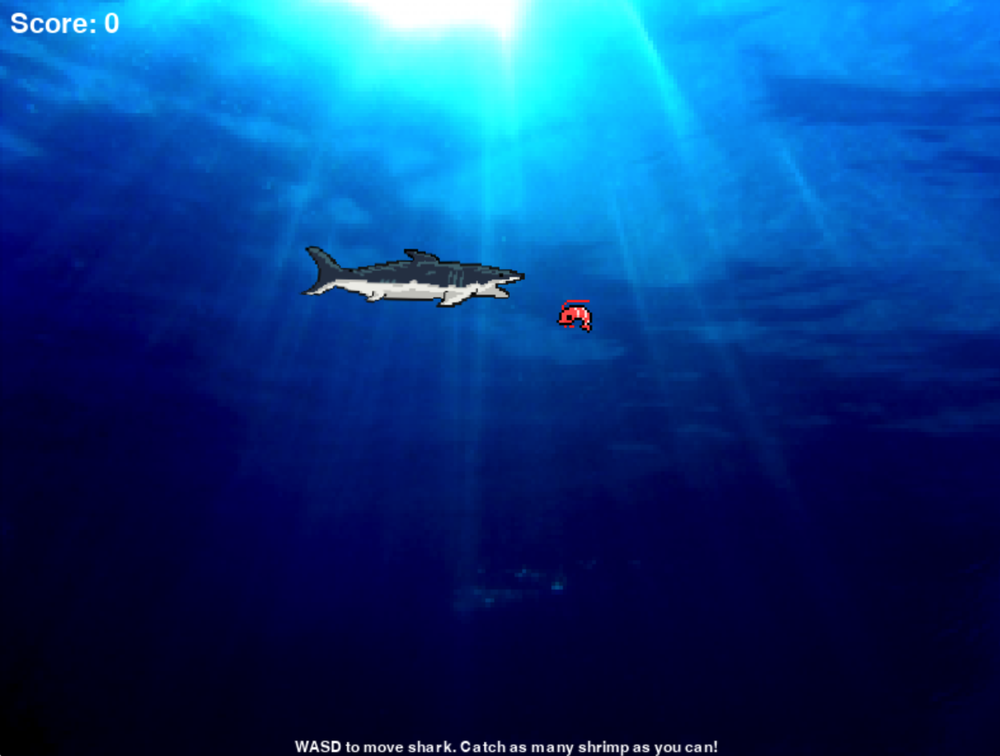

# Sprite Collisions in Pygame
Many games and interactive programs rely on interactions between sprites or graphic objects on the screen. This tech demonstration shows a few ways you can handle these events.

## Collisons between sprites using Rect objects
To now, we have been using the `Rect` object in Pygame to draw (or `blit`) our surfaces and also to move them around with methods (e.g. `Rect.x`).

The `Rect` object also gives us access to the `.colliderect()` method, which returns a Boolean (i.e. `True` or `False`) on the overlap or collision of two `Rect` objects. 



The file [`collisions_original.py`](collisions_original.py) demonstrates what you can do when the shark and shrimp sprites collide:

```python
# Handle shark and shrimp collisions
if shark_rect.colliderect(shrimp_rect):
    shrimp_rect.left = WIDTH
    shrimp_rect.centery = random.randint(20, HEIGHT - 20)
    # Increase score and rerender text surface
    player_score += 1
    text_score_string = f"Score: {player_score}"
    text_score_surface = font_score.render(text_score_string, True, WHITE)
```

The line `shark_rect.colliderect(shrimp_rect)` will return a Boolean if the two rects collide. We then handle the `True` condition to reset the shrimp position and increase the score.

<br><br>

## Collisons between sprites and mouse clicks
Another collision method available to a `Rect` object is `.collidepoint()`. This method takes an (x, y) coordinate point as a tuple and returns a Boolean if the point is contained within the `Rect`.

For example, the file [`collisions_plus_mouse.py`](collisions_plus_mouse.py) has this example:

```python
# Handle mouse clicks
mouse_input = pygame.mouse.get_pressed()

# Handle shrimp mouse clicks
if mouse_input[0]:  # Check if left mouse button is pressed
    mouse_pos = pygame.mouse.get_pos()
    if shrimp_rect.collidepoint(mouse_pos):
        shrimp_rect.left = WIDTH
        shrimp_rect.centery = random.randint(20, HEIGHT - 20)
        # Increase score and rerender text surface
        player_score += 1
        text_score_string = f"Score: {player_score}"
        text_score_surface = font_score.render(text_score_string, True, WHITE)
```

Similar to `pygame.key.get_pressed()`, we start by getting the state of mouse clicks with `pygame.mouse.get_pressed()`. It returns a tuple of Booleans giving the state of the left, middle, and right mouse buttons.

Then, we handle the event only when the left-click is pressed with `mouse_input[0]`.

Finally, we check the (x, y) coordinates of the mouse position with `shrimp_rect` using the `.collidepoint()` method here:

```python
if shrimp_rect.collidepoint(mouse_pos):
```

<br><br>

## Refactoring code for readability and modularity
For the final example, I've refactored the code from [`collisions_original.py`](collisions_original.py) to clean it up. 

Specifically, I tried to break down the organization of the game into a strict *input, processing, output* model. Look at my main game loop in th refactored version, [`collisions_refactored.py`](collisions_refactored.py):

```python
# Run main game loop
running = True

while running:
    handle_input()
    update_game_state()
    draw()
    clock.tick(30)
```

Allow yourself to write messy code to prioritize things working, but eventually, you also want your code to be clean and readable. 